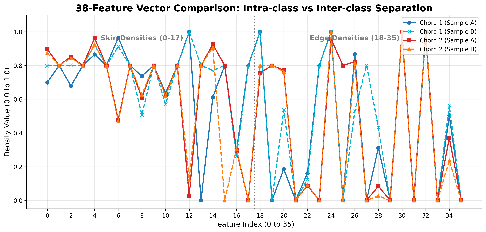

# Guitar Chord Recognition

## Overview
This project presents a robust pipeline designed to recognize guitar chords from pre-recorded videos using a fixed-angle camera focused on the guitar neck. The core challenge and primary focus of this project is the application of traditional Computer Vision (CV) techniques to extract pure geometric and morphological features from the fretboard, relying on Machine Learning (ML) strictly for the final multi-class classification.

The system currently recognizes 9 classes: A, Am, C, D, Dm, E, Em, G, and N (Null/Transition).

## Methodology & Pipeline
The project follows a structured data science workflow:
1. Data Ingestion: Collection of raw video footage and extraction of individual frames.
2. Feature Extraction: The core Computer Vision module that maps the guitar neck and extracts numerical data.
3. Data Cleaning: Smart balancing of the extracted feature dataset, with explicit handling of pure-empty vs transition null samples.
4. Grid Search: Hyperparameter optimization.
5. Model Training: Training and cross-validating the Random Forest classifier.
6. Video Prediction: Inference on unseen videos featuring temporal smoothing and dynamic grid tracking.

---

## 1. Dataset Collection & Annotation
A custom dataset was meticulously recorded and annotated specifically for this project to ensure high-quality, domain-specific data.

- Recording: A total of 168 videos were recorded using a fixed camera angle strictly focused on the guitar neck. To introduce environmental variance and ensure model robustness, the footage features 2 different guitars, varying lighting conditions, and diverse backgrounds. Each video was designed to isolate a single chord type, alternating between the active chord and a "non-chord" (rest/transition) state.

- Annotation: To maintain a balanced and homogeneous dataset across all classes, 130 videos were selected for the final annotation phase. Ground truth labels were meticulously mapped using JSON files, logging the exact start and end timestamps of the active chords and the null/transition states (`N`).

- Annotation Format: Each annotation file follows a simple structure:

    {
    "video": "C_01.mp4",
    "segments": [
      {"start": 0.0, "end": 1.78, "label": "N"},
      {"start": 1.78, "end": 9.80, "label": "C"}
    ]
  }
  

- Data Ingestion (Smart Frame Extraction):  
  The data_ingestion.py script parses the JSON annotations to programmatically extract frames from the videos. To maximize data quality and avoid motion blur during chord changes, it uses a targeted extraction logic:

  - Active Chords:  
    Extracts 3 distinct frames per segment (at the 25%, 50%, and 75% marks) to capture slight natural variations while ensuring fingers are fully placed on the fretboard.

  - Null/Transitions (N):  
    Extracts only 1 frame exactly at the midpoint (50%) of the segment to prevent over-representing the N class and maintain dataset balance.

  - Processing & Cleaning:  
    The raw feature extraction stage currently yields 1,291 raw feature vectors in chord_features.csv. These then undergo a smart cleaning and balancing phase, resulting in a final refined dataset of 1,088 feature vectors saved in chord_features_clean.csv for model training.

---

## 2. Computer Vision: Feature Extraction

The feature extraction process avoids black-box Deep Learning in favor of explicit geometric modeling. It analyzes each frame to output a 38-dimensional feature vector.

### Architectural Note (Dual-Script Approach)

The CV logic is split into two specialized scripts to separate training purity from inference resilience:

- `feature_extraction.py` (Training):  
  A strict pipeline that processes raw extracted frames and writes the final 38-feature vectors to CSV. If geometric reconstruction fails (for example, no reliable string model can be estimated), the frame is skipped to preserve dataset quality.

- `feature_extractor.py` (Inference):  
  A resilient module used during video prediction. It implements the same core geometric logic, but introduces an intelligent grid_cache with Exponential Moving Average (EMA) smoothing and Jump-Veto logic, so that temporary occlusions do not cause the fretboard grid to collapse.

---

### Step A: String Detection (Sobel Y & Hough)

- The image is converted to grayscale and enhanced using CLAHE (Contrast Limited Adaptive Histogram Equalization) to normalize lighting.
- A Sobel filter (Y-axis) combined with a Gaussian Blur isolates horizontal metallic reflections.
- The binary string map is refined through morphological closing.

Before Hough detection, the string search region is spatially constrained:
- a left crop removes the headstock-side interference
- a top crop removes the upper part of the frame
- a bottom crop removes the lower part of the frame

- HoughLinesP detects line segments.  
  An anchor-based perspective algorithm groups these segments, filters out the wood edge (**Neck Killer**), and calculates linear equations (`y = mx + q`) for the 6 guitar strings.

---

### Step B: Fret Detection (Sobel X & Buddy System)

- A Sobel filter (X-axis) isolates the vertical metallic frets.
- The binary fret map is refined through morphological opening with a vertical kernel, followed by dilation.

Fret search is not performed globally on the image. Instead:
- the pipeline builds a string fence mask from the estimated top and bottom strings
- this produces a polygonal fretboard ROI

Additional filtering:
- left-side suppression
- right headstock suppression

- A custom Buddy System unifies fragmented vertical lines by grouping segments with nearby x-centers and sufficient vertical span.

- A geometric projector estimates:
  - the position of the nut
  - the first 3 fret lines (4 vertical boundaries total)

This establishes the rigid bounded grid.

---

### Step C: Hand Isolation & Density Calculation

- Skin Mask:  
  The player’s hand is isolated using a strict RGB thresholding logic:

    R > 95
  G > 40
  B > 20
  (R - G) > 35
  abs(R - B) > 15
  

- If fretboard geometry is available, the skin mask is restricted to the region inside the top and bottom strings, removing irrelevant regions.

- A left crop at 35% of the frame width further suppresses noise.

- Morphological operations:
  - OPEN (5×5 ellipse)
  - CLOSE (15×15 ellipse)

  These remove noise and create a compact hand blob.

- Edge Mask:  
  A Canny edge detector extracts contours from the blurred grayscale frame, then dilates them and masks them over the cleaned skin blob.

---

### Step D: The 38-Feature Vector

The intersection of 6 strings and 4 projected fret boundaries creates 18 functional cells (6 × 3).

For each cell:

1. Skin Density  
   Percentage of skin pixels inside the cell.

2. Edge Density  
   Presence of edges converted into a boosted binary signal:
   - if raw edge density > 0.01 → 0.8
   - else → 0.0

3. Center of Mass (COM)  
   The spatial average of active skin cells (X, Y), used to capture global hand position.

---

## 2.1 Feature Discriminability & Data Signature

To validate the robustness of the 38-feature vector before training, a Signature Verification Test was performed.

By computing the Euclidean Distance between feature vectors, we analyzed how geometric patterns vary across chord classes.

  

### Key Findings (Empirical Data)

- Intra-class Variation (Same chord):  
  Distance approximately 1.1 – 1.3.  
  This represents the natural “noise” caused by micro-movements of the hand and slight lighting variations.

- Inter-class Variation (Different chords):  
  Distance approximately 2.2 – 2.5.  
  The distance roughly doubles when comparing different chords (e.g., C vs A).

---

### Analysis

The results show a clear mathematical separation between classes.

While the intra-class distance is low (indicating a stable feature extractor), the inter-class distance is significantly higher, confirming that the combination of:

- Skin Density
- Boosted Edge Signal
- Center of Mass

creates a unique “geometric fingerprint” for each chord.

This measurable gap simplifies the classification task, allowing the Random Forest to separate classes with lower ambiguity.

---

## 3. Machine Learning: Classification Model

Instead of utilizing Convolutional Neural Networks (CNNs), which require massive datasets and obscure the underlying geometric rules, this project employs a Random Forest Classifier.

### Why Random Forest?

Random Forest is highly interpretable, computationally efficient, and well suited for structured tabular data (our 38-feature geometric vector).

By relying on explicit feature engineering, the ML model acts as a pure statistical classifier rather than a feature extractor, maintaining a clear boundary between the CV logic and the prediction logic.

---

### Data Cleaning & Balancing

Before training, the extracted raw feature CSV is processed by:

src/features/data_cleaner.py

The cleaning logic is not a generic outlier removal stage. Instead, it is a smart null balancing strategy:

- All chord samples are preserved.
- Null samples are split into:
  - Pure Empty frames: filenames like N_NULL_...
  - Transition Nulls: filenames like N_A_..., N_Am_..., etc.
- The cleaner:
  - keeps all pure-empty guitar frames
  - samples approximately 10 frames per transition type from chord-transition nulls

This produces a more balanced null class while preserving both:
- actual empty fretboard states
- realistic transition ambiguity

---

### Grid Search & Optimization

Hyperparameter tuning is implemented in:

src/models/grid_search.py

It is optimized specifically for the macro F1-score rather than standard accuracy.

- Rationale:  
  The dataset presents class imbalances (e.g., Em and G have significantly fewer samples than Dm or `N`).  
  Optimizing for accuracy alone would bias the model toward majority classes.

Macro F1 enforces a better balance between Precision and Recall.

---

### Winning Hyperparameters (train_model.py)

- n_estimators = 1000
- max_depth = 20
- max_features = 'sqrt'
- criterion = 'gini'
- class_weight = 'balanced_subsample'
- min_samples_split = 2
- min_samples_leaf = 1
- random_state = 42

---

### Model Performance

The model is evaluated using:

- GroupShuffleSplit  
  Ensures frames from the same sequence do not leak into the test set.

- StratifiedGroupKFold  
  Used for internal cross-validation on the training partition.

---

### Latest Benchmark Results

- Internal CV Accuracy: 79.51%
- Final Test Accuracy: 83.16%

---

### Classification Report (Test Set)

| Class | Precision | Recall | F1-score | Support |
|------|----------|--------|----------|--------|
| A    | 0.92     | 1.00   | 0.96     | 12     |
| Am   | 0.86     | 1.00   | 0.93     | 32     |
| C    | 1.00     | 0.79   | 0.88     | 24     |
| D    | 0.50     | 0.85   | 0.63     | 13     |
| Dm   | 0.88     | 0.95   | 0.91     | 38     |
| E    | 1.00     | 0.93   | 0.96     | 27     |
| Em   | 0.67     | 1.00   | 0.80     | 6      |
| G    | 0.55     | 1.00   | 0.71     | 6      |
| N    | 0.85     | 0.34   | 0.49     | 32     |

---

| Metric        | Value |
|--------------|------|
| Accuracy     | 0.83 |
| Macro Avg F1 | 0.81 |
| Weighted F1  | 0.82 |

---

### Confusion Matrix

You can view the generated Confusion Matrix image here to analyze misclassifications between visually similar chords:

  

---

Note:  
The low recall on the N (Null) class in static frames remains one of the main weaknesses of the current system.

This is partially mitigated during video inference through:
- confidence thresholding
- temporal smoothing

---

## 4. Video Inference & Temporal Logic
Applying a static frame classifier to a fluid video introduces unique challenges. These are handled inside predict_video.ipynb.

### Grid Caching (Occlusion Resilience)

When the player’s hand covers the fretboard, Sobel/Hough-based geometry extraction can fail.

The inference module uses a grid_cache to retain the most recent valid string and fret geometry.

---

### EMA + Jump-Veto Logic

The inference extractor does not blindly reuse the previous frame.

Instead, it compares the newly estimated grid with the cached one:

- if the geometry jumps too abruptly → the new grid is rejected
- otherwise → the new and cached grids are blended using Exponential Moving Average (EMA)

---

### Performance Optimization: Frame Skipping Engine

To significantly speed up processing time, the inference module implements a frame-skipping engine.
Heavy geometric feature extraction and model prediction are only performed every N frames (e.g., `PROCESS_EVERY_N_FRAMES = 3`). The intermediate frames inherit the previous logical state, delivering up to a 3x speedup in video rendering without sacrificing temporal coherence.

### Inertia-Based Temporal Smoothing

Instead of relying on a standard rolling window buffer (`deque`), the temporal logic now uses an advanced "Inertia" state machine governed by probability margins. This prevents flickering and enforces stable chord holds:

- Activation Threshold (0.25): To exit the `N` (Null) state, a newly detected chord must reach at least 25% confidence.
- Drop Threshold (0.15): If the currently active chord's confidence plummets below 15%, the system immediately drops the prediction back to `N`.
- Inertia Margin (0.15): To dethrone the currently active chord, a challenger chord cannot simply have a higher probability; it must beat the active chord's current probability by a clear 15% margin.

This "battle of probabilities" ensures that micro-variations in hand posture do not cause erratic chord switching.

---

## Repository Structure

├── data/
│   ├── annotations/              # Raw labels and metadata (JSON)
│   ├── extracted_features/       # Extracted CSV feature files (raw and cleaned)
│   ├── processed_frames/         # Extracted training frames from annotated videos
│   ├── raw_videos/               # Input videos for ingestion and inference
│   └── visualizations/           # Generated plots for documentation and analysis
│       ├── confusion_matrix_v4.png
│       └── feature_separation_plot.png

├── models/
│   └── guitar_chord_rf_model.pkl # Trained Random Forest model

├── notebooks/
│   ├── 01_data_exploration.ipynb
│   └── 02_feature_extraction.ipynb

├── src/
│   ├── data_preprocessing/
│   │   └── data_ingestion.py     # Frame extraction from annotated videos
│   │
│   ├── debug/                    # Debug scripts and intermediate visual tools
│   │
│   ├── features/
│   │   ├── data_cleaner.py       # Smart balancing and cleaning
│   │   ├── feature_extraction.py # Strict CV pipeline (training)
│   │   └── feature_extractor.py  # Resilient CV module (inference)
│   │
│   └── models/
│       ├── grid_search.py        # Hyperparameter tuning
│       └── train_model.py        # Training, validation, evaluation

├── predict_video.ipynb           # Video inference notebook
├── requirements.txt
└── README.md

## File Highlights

- `src/features/feature_extraction.py`  
  Strict extraction script used only for generating the training dataset CSV.  
  Frames are skipped if the geometric model cannot be reliably reconstructed.

- `src/features/feature_extractor.py`  
  CV module used during video inference.  
  Applies the same geometric logic but adds:
  - grid_cache
  - EMA smoothing
  - Jump-Veto sanity checks  
  This makes the system robust to temporary hand occlusions.

- `src/features/data_cleaner.py`  
  Loads the raw 38-feature CSV and performs dataset balancing:
  - preserves all chord samples
  - keeps all N_NULL examples
  - samples transition nulls per source chord  
  Produces the final cleaned dataset.

- `src/models/train_model.py`  
  End-to-end training pipeline:
  - loads cleaned features
  - builds group labels from filenames
  - performs train/test split
  - runs cross-validation
  - prints classification report
  - saves confusion matrix
  - serializes the final .pkl model

- `src/models/grid_search.py`  
  Performs Random Forest hyperparameter tuning using:
  - GridSearchCV
  - StratifiedGroupKFold

- `predict_video.ipynb`  
  Interactive inference notebooke:
  - loads trained model and `feature_extractor` module
  - frame-skipping engine for up to 3x faster processing
  - inertia-based temporal logic (Activation, Drop, and Margin thresholds)
  - overlay of detected chords with real-time probability debugging
  - saves annotated output video

---

## Installation & Requirements

1. Clone the repository  
2. Ensure Python 3.10 is installed  
3. Install dependencies:

pip install -r requirements.txt

### Key Dependencies

- opencv-python
- numpy
- scikit-learn
- pandas
- matplotlib
- seaborn
- ipywidgets

---

## How to Use

### Train the Model

1. Run:

   src/data_preprocessing/data_ingestion.py

   Extracts frames from annotated raw videos.

2. Run:

   src/features/feature_extraction.py

   Generates raw 38-feature dataset (`chord_features.csv`).

3. Run:

   src/features/data_cleaner.py

   Applies null balancing and produces cleaned dataset (`chord_features_clean.csv`).

4. Run:

   src/models/train_model.py

   - performs train/test split
   - runs cross-validation
   - prints classification report
   - saves confusion matrix
   - exports final .pkl model

---

### Run Grid Search

1. Run:

   src/models/grid_search.py

2. This evaluates Random Forest configurations using:
   - grouped cross-validation
   - macro F1 scoring

---

### Run Video Inference

1. Open:

   predict_video.ipynb

2. Run the UI cell to select a local .mp4 file

3. Execute inference cells:
   - loads trained model
   - imports feature_extractor
   - processes frames
   - outputs annotated video

Displayed overlays include:
- detected strings
- fret grid
- COM proxy
- predicted chord

---

## Limitations & Future Work

### Current Limitations

- Resolution & Speed  
  Higher resolution improves stability (cleaner fret/edge detection), but increases processing time.  
  Not yet suitable for real-time use.

- Environmental Sensitivity  
  Performance depends on:
  - lighting conditions
  - consistent camera angle

- Skin Tone Bias (Algorithmic Fairness)  
  Hand detection relies on fixed RGB thresholds → not robust across:
  - different skin tones
  - varying illumination

- Null Detection  
  The model struggles with the N class, especially on static frames, where transitions resemble partial chords.

---

### Future Improvements

- Generalize to lower-resolution inputs
- Optimize inference for near real-time performance
- Replace RGB thresholding with robust hand segmentation
- Improve temporal modeling (stronger sequential logic)
- Expand chord coverage beyond current 9 classes
