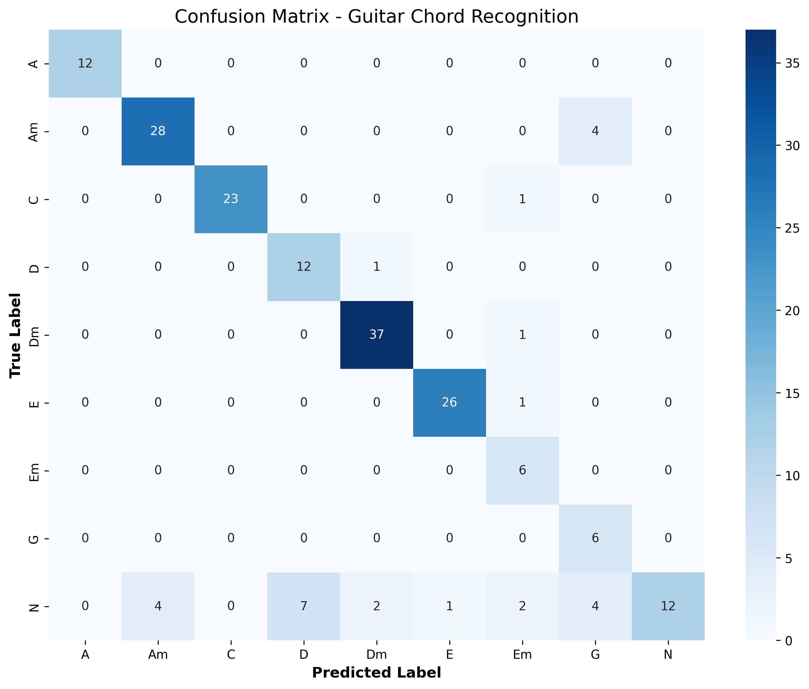

# Guitar Chord Recognition

## Overview
This project presents a robust pipeline designed to recognize guitar chords from pre-recorded videos using a fixed-angle camera focused on the guitar neck. The core challenge and primary focus of this project is the application of traditional Computer Vision (CV) techniques to extract pure geometric and morphological features from the fretboard, relying on Machine Learning (ML) strictly for the final multi-class classification. 

The system currently recognizes 9 classes: **A, Am, C, D, Dm, E, Em, G**, and **N** (Null/Transition).

## Methodology & Pipeline
The project follows a structured data science workflow:
1. **Data Ingestion:** Collection of raw video footage and extraction of individual frames.
2. **Feature Extraction:** The core Computer Vision module that maps the guitar neck and extracts numerical data.
3. **Data Cleaning:** Removal of noisy frames, anomalies, and redundant 'N' (null) frames to balance the dataset.
4. **Grid Search:** Hyperparameter optimization.
5. **Model Training:** Training and cross-validating the Random Forest classifier.
6. **Video Prediction:** Inference on unseen videos featuring temporal smoothing and dynamic tracking.

---

## 1. Dataset Collection & Annotation
A custom dataset was meticulously recorded and annotated specifically for this project to ensure high-quality, domain-specific data.

* **Recording:** A total of 168 videos were recorded using a fixed camera angle strictly focused on the guitar neck. To introduce environmental variance and ensure model robustness, the footage features **2 different guitars**, varying lighting conditions, and diverse backgrounds. Each video was designed to isolate a single chord type, alternating between the active chord and a "non-chord" (rest/transition) state.
* **Annotation:** To maintain a balanced and homogeneous dataset across all classes, 130 videos were selected for the final annotation phase. Ground truth labels were meticulously mapped using JSON files, logging the exact start and end timestamps of the active chords and the null/transition states ('N').
* **Processing & Cleaning:** Based on the JSON timestamps, **1,292 raw frames** were extracted. These frames underwent a rigorous cleaning and filtering phase (removing motion blur, extreme lighting anomalies, and redundant 'N' frames), resulting in a final, refined dataset of **1,089 high-quality feature vectors** saved to the CSV for model training.

---

## 2. Computer Vision: Feature Extraction
The feature extraction process avoids black-box Deep Learning in favor of explicit geometric modeling. It analyzes each frame to output a 38-dimensional feature vector. 

**Architectural Note (Dual-Script Approach):** The CV logic is split into two specialized scripts to separate training purity from inference resilience:
* `feature_extraction.py` *(Training)*: A strict pipeline that processes raw frames. If strings or frets are occluded, it deliberately drops the frame to ensure the Random Forest trains only on pure, high-quality geometric data.
* `feature_extractor.py` *(Inference)*: A resilient module used during video prediction. It executes the same core mathematics but implements a `try/except` fallback to a `grid_cache`. If dynamic occlusion (e.g., hand movement) causes extraction failure, it rescues the grid geometry from the previous frame to maintain continuous tracking.

### Step A: String Detection (Sobel Y & Hough)
* The image is converted to grayscale and enhanced using **CLAHE** (Contrast Limited Adaptive Histogram Equalization) to normalize lighting.
* A **Sobel filter (Y-axis)** combined with a Gaussian Blur isolates horizontal metallic reflections.
* **HoughLinesP** detects line segments. An anchor-based perspective algorithm groups these segments, filtering out the wood edge (Neck Killer) and calculating linear equations (`y = mx + q`) for the 6 guitar strings.

### Step B: Fret Detection (Sobel X & Buddy System)
* A **Sobel filter (X-axis)** isolates the vertical metallic frets.
* A custom **Buddy System** algorithm unifies fragmented vertical lines by calculating distances between segments, effectively filtering out background noise and hand reflections.
* A geometric projector calculates the position of the nut and the first 4 frets using a constant shrink ratio, establishing a rigid bounding matrix.

### Step C: Hand Isolation & Density Calculation
* **Skin Mask:** The player's hand is isolated using a strict RGB thresholding logic. Morphological operations (OPEN and CLOSE) remove noise and fill shadows, creating a solid blob.
* **Edge Mask:** A **Canny** edge detector finds the strong contours of the pressing fingers, masked specifically over the skin blob.

### Step D: The 38-Feature Vector
The intersection of strings and 4 fret lines creates a tracking grid of 18 functional cells (6 strings × 3 fret gaps). For each cell, the system calculates:
1. **Skin Density:** Percentage of skin pixels in the cell.
2. **Edge Density:** Presence of Canny edges (weighted boost) indicating finger pressure.
3. **Center of Mass (COM):** The X and Y coordinates of the spatial average of active skin cells, helping the model distinguish between high and low fretboard positions.

---

## 3. Machine Learning: Classification Model
Instead of utilizing Convolutional Neural Networks (CNNs), which require massive datasets and obscure the underlying geometric rules, this project employs a **Random Forest Classifier**.

### Why Random Forest?
Random Forest is highly interpretable, computationally efficient, and perfectly suited for structured tabular data (our 38-feature geometric vector). By relying on explicit feature engineering, the ML model acts as a pure statistical classifier rather than a feature extractor, maintaining a clear boundary between the CV logic and the prediction logic.

### Grid Search & Optimization
Hyperparameter tuning was conducted using **Grid Search**, optimized specifically for the **macro F1-score** rather than standard accuracy. 
* *Rationale:* The dataset presents class imbalances (e.g., 'Em' and 'G' have significantly fewer support samples than 'Dm' or 'N'). Optimizing for accuracy would bias the model toward majority classes. The F1-score ensures a strict balance between Precision and Recall, which is crucial for identifying complex chord shapes.

### Grid Search & Optimization
Hyperparameter tuning was conducted using **Grid Search**, optimized specifically for the **macro F1-score** rather than standard accuracy. 
* *Rationale:* The dataset presents class imbalances (e.g., 'Em' and 'G' have significantly fewer support samples than 'Dm' or 'N'). Optimizing for accuracy would bias the model toward majority classes. The F1-score ensures a strict balance between Precision and Recall, which is crucial for identifying complex chord shapes.

**Winning Hyperparameters:**
After extensive cross-validation, the optimal Random Forest configuration was defined as:
* `n_estimators: 1000` (Ensures a highly robust forest to capture geometric nuances)
* `max_depth: 15` (Controls tree depth to prevent overfitting on specific frames)
* `max_features: 'log2'` 
* `criterion: 'gini'`
* `class_weight: 'balanced'` (Crucial for penalizing mistakes on minority classes like 'Em' and 'G')
* `min_samples_split: 2`
* `min_samples_leaf: 1`

### Model Performance
The model was evaluated using GroupShuffleSplit (ensuring frames from the same video sequence do not leak into the test set) and StratifiedGroupKFold cross-validation.

* **Internal CV Accuracy:** 80.07%
* **Final Test Accuracy:** 85.26%

**Classification Report (Test Set):**
```text
              precision    recall  f1-score   support
           A       1.00      1.00      1.00        12
          Am       0.88      0.88      0.88        32
           C       1.00      0.96      0.98        24
           D       0.63      0.92      0.75        13
          Dm       0.93      0.97      0.95        38
           E       0.96      0.96      0.96        27
          Em       0.55      1.00      0.71         6
           G       0.43      1.00      0.60         6
           N       1.00      0.38      0.55        32

    accuracy                           0.85       190
```

### Confusion Matrix
*(You can view the generated Confusion Matrix image here to analyze misclassifications between visually similar chords).*
<p align="center">
  
</p>

*Note: The low recall on the 'N' (Null) class in static frames was anticipated and strategically solved during the video inference stage.*

---

## 4. Video Inference & Temporal Logic
Applying a static frame classifier to a fluid video introduces unique challenges, which were solved using specific tracking algorithms in `predict_video.ipynb`.

* **Grid Caching (Occlusion Resilience):** When the player's hand entirely covers the fretboard, Sobel/Hough transforms fail. A `grid_cache` system retains the geometric matrix from the last successful frame, ensuring continuous tracking.
* **Confidence Thresholding (The Ghost Effect):** 2D cameras lack depth (Z-axis). Hovering fingers generate the same skin mask as pressing fingers, confusing transitions. Instead of retraining on noisy data, the inference script uses `predict_proba`. If the model's confidence drops below 50-60%, it forcefully outputs the 'N' class, accurately capturing chord transitions.
* **Dynamic Temporal Smoothing:** To prevent classification flickering, a `deque` buffer acts as a temporal filter. It dynamically calculates its window size based on the video's FPS to maintain exactly a 0.5-second memory, ensuring smooth, human-readable output on any video format.

---

## Repository Structure & Files

```text
├── data/
│   ├── annotations/            # Raw labels and metadata
│   ├── extracted_features/     # Extracted CSV feature files (raw and cleaned)
│   ├── processed_frames/       # Cleaned images used for model training
│   ├── raw_videos/             # Input videos for the inference engine
│   └── processed_videos/       # Rendered outputs with CV overlays
├── models/
│   ├── guitar_chord_rf_model.pkl # The trained Random Forest model
│   └── confusion_matrix.png    # Visual evaluation of the test set
├── notebooks/
│   ├── data_exploration.ipynb  # Initial EDA, viewing class distributions
│   └── feature_extraction.ipynb # Prototyping CV algorithms visually
├── src/
│   ├── data_preprocessing/     
│   │   └── data_ingestion.py   # Scripts for initial data loading and frame extraction
│   ├── features/
│   │   ├── feature_extraction.py # Strict CV pipeline for building the training dataset
│   │   └── feature_extractor.py  # Resilient CV module (with caching) for video inference
│   └── models/
│       └── train_model.py      # Grid search, cross-validation, and model saving
├── predict_video.ipynb         # Interactive UI for running video inference
├── requirements.txt
└── README.md
```

### File Highlights:
* `src/features/feature_extraction.py`: The strict extraction script used solely for generating the training dataset CSV. It discards occluded frames to maintain data purity.
* `src/features/feature_extractor.py`: The core CV module utilized by the video inference engine. It applies the exact same geometric logic but features a short-term memory (grid_cache) to survive hand occlusion during real-time video processing.
* `src/models/train_model.py`: Generates the ML model from the extracted CSV features, handles internal grouping, executes the train/test split, prints the classification report, and generates the confusion matrix.
* `predict_video.ipynb`: A user-friendly, interactive notebook utilizing `ipywidgets`. Allows the user to browse their local machine for a video, processes it frame-by-frame, and outputs an annotated video to `data/processed_videos/`.

---

## Installation & Requirements

1. Clone the repository.
2. Ensure you have Python 3.10 installed.
3. Install the required dependencies:
```bash
pip install -r requirements.txt
```

*Key dependencies include: `opencv-python`, `numpy`, `scikit-learn`, `pandas`, `seaborn`, `ipywidgets`.*

## How to Use

**To Train the Model:**
1. Execute `src/data_preprocessing/data_ingestion.py` (if you need to extract new frames from raw datasets).
2. Execute `src/features/feature_extraction.py` to process the frames and generate the 38-feature CSV file. 
3. Execute `src/models/train_model.py`. This script reads the cleaned features from `data/extracted_features/`, performs the training with optimized parameters, and saves the `.pkl` model and confusion matrix to the `models/` folder.

**To Run Video Inference:**
1. Open `predict_video.ipynb` in the root directory.
2. Run the UI cell to open the file explorer and select a local MP4 file.
3. Run the inference cell. The script will load the model, import the `feature_extractor` module, and output an annotated video to `data/processed_videos/` displaying the detected strings, frets, Center of Mass, and the predicted chord.

---

## Limitations & Future Work
* **Resolution & Speed:** The pipeline is currently optimized for 4K video to ensure enough pixel density for the Canny edge detector. Consequently, processing time is high and cannot currently run in real-time.
* **Environmental Sensitivity:** The explicit geometric approach is sensitive to lighting conditions and requires a relatively consistent POV angle.
* **Future Improvements:** 
  * Generalize the mathematical ratios to accept low-resolution videos.
  * Implement code optimization (or C++ OpenCV porting) to achieve real-time 4K inference.
  * Explore advanced kinematic hand tracking (e.g., MediaPipe) if trained with a dedicated dataset to replace standard RGB skin thresholding.

